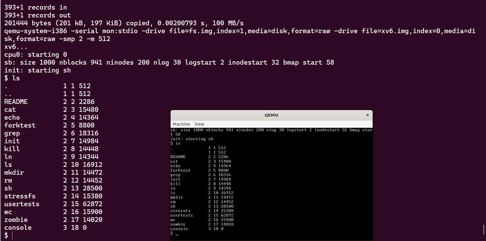
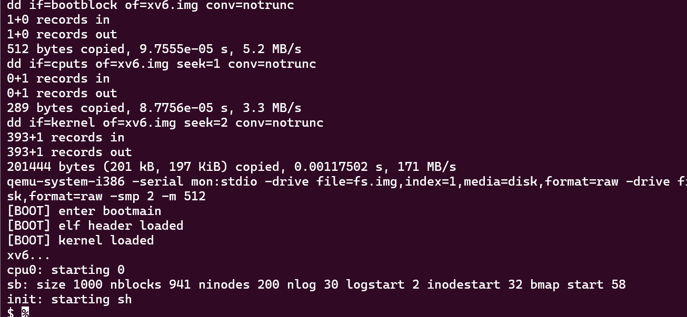
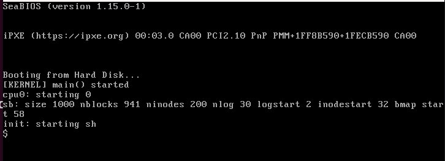

# 2026读书实践周

## TASK 1

fork项目后，本地clone一份并执行make qemu启动系统

```
make qemu
```



上传commit

```bash
➜  mit-xv6-task git:(master) echo "xv6 boots successfully with make qemu" >> TASK1.md
➜  mit-xv6-task git:(master) ✗ git add -A
➜  mit-xv6-task git:(master) ✗ git commit -m "chore: boot xv6 successfully with make qemu"
[master d36e529] chore: boot xv6 successfully with make qemu
 1 file changed, 1 insertion(+)
 create mode 100644 TASK1.md
➜  mit-xv6-task git:(master) git push
Enumerating objects: 4, done.
Counting objects: 100% (4/4), done.
Delta compression using up to 16 threads
Compressing objects: 100% (2/2), done.
Writing objects: 100% (3/3), 320 bytes | 320.00 KiB/s, done.
Total 3 (delta 1), reused 0 (delta 0), pack-reused 0
remote: Resolving deltas: 100% (1/1), completed with 1 local object.
To github.com:0rb1ts/mit-xv6-task
   eeb7b41..d36e529  master -> master
```

## TASK 2

#### bootasm.S

1. 先关闭中断，再去清空段寄存器，随之设置A20地址线清空20及以上地址位。
2. 设置全局描述符寄存器使其指向gdt表，gdt表中设置内核null、code、data段，再设置CR0寄存器将实模式转换为保护模式。
3. 跳转start32，设置段寄存器和栈寄存器。

#### bootmain.S

1. 跳到bootmain函数，将内核elf信息段载入内存。
2. 根据elf信息段，将text段，data段等载入内存。
3. 进入text段中的内核入口。

#### entry.S

1. 设置CR4寄存器，开启大页扩展，将页扩展到4MB。
2. 将pde页目录表指针存入CR3寄存器。
3. 设置CR0寄存器，开启分页模式。
4. 跳到main函数执行内核初始化。

## TASK 3

由于bios初始只加载一个512字节扇区来实现内核载入，这导致如果直接修改**bootmain**进行输出很容易超出512字节范围，故我这里选择创建一个新cputs文件并载入磁盘，再在bootmain函数载入磁盘并跳转过去执行函数来达到输出的目的。

步骤大致如下：

1.先创建cputs文件，用于输出相关信息。

```C
#include "types.h"
#include "elf.h"
#include "x86.h"
#include "memlayout.h"

void boot_serial_init(void);
void boot_serial_putc(int c);

void
boot_serial_puts(const char *s)
{
  for (; *s; s++) {
    boot_serial_putc((uchar)*s);
  }
}

void
boot_serial_init(void)
{
  // Initialize COM1: 0x3F8
  outb(0x3F8 + 1, 0x00);    // Disable interrupts
  outb(0x3F8 + 3, 0x80);    // Enable DLAB (set baud rate divisor)
  outb(0x3F8 + 0, 0x03);    // Divisor low byte (38400 baud if base 115200)
  outb(0x3F8 + 1, 0x00);    // Divisor high byte
  outb(0x3F8 + 3, 0x03);    // 8 bits, no parity, one stop bit
  outb(0x3F8 + 2, 0xC7);    // Enable FIFO, clear them, with 14-byte threshold
  outb(0x3F8 + 4, 0x0B);    // IRQs enabled, RTS/DSR set
}

void
boot_serial_putc(int c)
{
  // Wait for Transmitter Holding Register empty (LSR bit 5)
  while ((inb(0x3F8 + 5) & 0x20) == 0)
    ;
  outb(0x3F8 + 0, c);
}

void
show_enter(){
  boot_serial_puts("[BOOT] enter bootmain\n");
}

void
show_elf_loaded(){
  boot_serial_puts("[BOOT] elf header loaded\n");
}

void
show_kernel_loaded(){
  boot_serial_puts("[BOOT] kernel loaded\n");
}
```

2.修改makefile，编译cputs并载入磁盘。

```makefile
xv6.img: bootblock kernel cputs
	dd if=/dev/zero of=xv6.img count=10000
	dd if=bootblock of=xv6.img conv=notrunc
	dd if=cputs of=xv6.img seek=1 conv=notrunc
	dd if=kernel of=xv6.img seek=2 conv=notrun

cputs: cputs.c
	$(CC) $(CFLAGS) -fno-pic -O -nostdinc -I. -c cputs.c -o cputs.o
	$(LD) $(LDFLAGS) -N -e cputs_entry -Ttext 0x20000 -o cputs.elf cputs.o
	$(OBJCOPY) -S -O binary -j .text -j .rodata cputs.elf cputs
```

3.bootmain从扇区载入并调用执行。

```C
void
bootmain(void)
{
  void *cputs = (void(*)(const char*))0x20000;
  readseg((uchar*)cputs, 512, 0);
  void (*boot_serial_init)(void) = (void(*)(void))cputs;
  void (*func)(void) = (void(*)(void))((char*)cputs+0x9B);
  ...
 }
```

运行可得到显示信息。



在main函数插入cprintf调用即可输出KERNEL启动信息。

```C
int
main(void)
{
  cprintf("[KERNEL] main() started\n");
```

